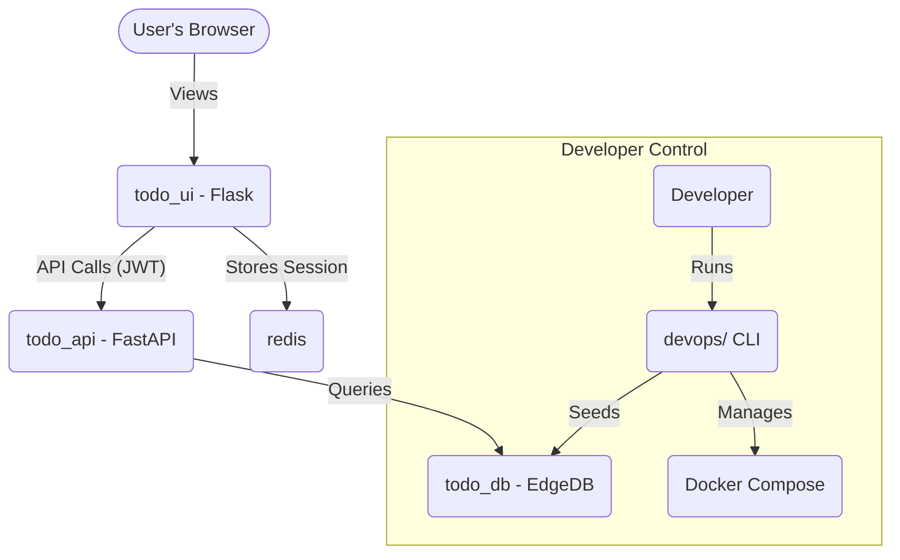

# [To - Do]

<p align="center">
  
  
  
</p>

A one-sentence description of what this full-stack project does.

## 🚀 Quick Start (Local Development)

This project is managed by a central `devops` CLI.

1.  **Navigate to the `devops` directory:**
    ```
    cd devops
    ```
2.  **Install CLI dependencies:**
    ```
    uv sync
    ```
3.  **Run the automated "start dev" command:**
    ```
    uv run cli service start-dev
    ```
This single command will:
- Purge old containers
- Generate all `.env` files and secrets
- Build and start all services (`api`, `ui`, `db`, `redis`)
- Seed the database with a root user
- Prompt you to create a regular user

Your application is now running at **`http://localhost:5000`**.

## 🏛️ Architecture

A high-level overview of the services and how they interact.



## 📁 Project StructureA tree view of the main repositories/folders..

```
├── api/          # Backend FastAPI service
├── ui/           # Frontend Flask/HTMX service
├── db/           # EdgeDB Docker configuration
├── dbschema/     # EdgeDB .gel schema files
├── devops/       # Main CLI, docker-compose.yml, and envs
└── README.md     # This file
```
